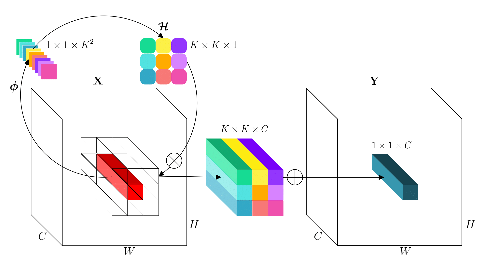

# involution

Official implementation of a neural operator as described in [Involution: Inverting the Inherence of Convolution for Visual Recognition]() (CVPR'21)

By [Duo Li](https://duoli.org/), [Jie Hu](https://github.com/hujie-frank), [Changhu Wang](https://scholar.google.com/citations?user=DsVZkjAAAAAJ), [Xiangtai Li](https://github.com/lxtGH), Qi She, Lei Zhu, [Tong Zhang](http://tongzhang-ml.org/), and [Qifeng Chen](https://cqf.io/)

<p align="center"></p>

**TL; DR.**`involution` is a general-purpose neural primitive that is versatile for a spectrum of deep learning models on different vision tasks. `involution` bridges `convolution` and `self-attention` in design, while being more efficient and effective than `convolution`, simpler than `self-attention` in form. 

## Getting Started

This repository is fully built upon the [OpenMMLab](https://openmmlab.com/) toolkits. For each individual task, the config and model files follow the same directory organization as [mmcls](https://github.com/open-mmlab/mmclassification), [mmdet](https://github.com/open-mmlab/mmdetection), and [mmseg](https://github.com/open-mmlab/mmsegmentation) respectively, so just copy-and-paste them to the corresponding locations to get started.

For example, in terms of evaluating detectors
```shell
git clone https://github.com/open-mmlab/mmdetection # and install

cp det/mmdet/models/backbones/* mmdetection/mmdet/models/backbones
cp det/mmdet/models/necks/* mmdetection/mmdet/models/necks
cp det/mmdet/models/utils/* mmdetection/mmdet/models/utils

cp det/configs/_base_/models/* mmdetection/mmdet/configs/_base_/models
cp det/configs/_base_/schedules/* mmdetection/mmdet/configs/_base_/schedules
cp det/configs/involution mmdetection/mmdet/configs -r

cd mmdetection
# evaluate checkpoints
bash tools/dist_test.sh ${CONFIG_FILE} ${CHECKPOINT_FILE} ${GPU_NUM} [--out ${RESULT_FILE}] [--eval ${EVAL_METRICS}]
```

For more detailed guidance, please refer to the original [mmcls](https://github.com/open-mmlab/mmclassification), [mmdet](https://github.com/open-mmlab/mmdetection), and [mmseg](https://github.com/open-mmlab/mmsegmentation) tutorials.

Currently, we provide an memory-efficient implementation of the involuton operator based on [CuPy](https://cupy.dev/). Please install this library in advance. A customized CUDA kernel would bring about further acceleration on the hardware. Any contribution from the community regarding this is welcomed!

## Model Zoo

The parameters/FLOPs&#8595; and performance&#8593; compared to the convolution baselines are marked in the parentheses. Part of these checkpoints are obtained in our reimplementation runs, whose performance may show slight differences with those reported in our paper. Models are trained with 64 GPUs on ImageNet, 8 GPUs on COCO, and 4 GPUs on Cityscapes.

### Image Classification on ImageNet

|         Model         | Params(M) | FLOPs(G) | Top-1 (%) | Top-5 (%) | Config | Download |
|:---------------------:|:---------:|:--------:|:---------:|:---------:|:---------:|:--------:|
| RedNet-26             |  9.23<sub>(32.8%&#8595;)</sub>     | 1.73<sub>(29.2%&#8595;)</sub>     | 75.96 | 93.19 | [config](https://github.com/d-li14/involution/blob/main/cls/configs/rednet/rednet26_b32x64_warmup_coslr_imagenet.py) | [model](https://hkustconnect-my.sharepoint.com/:u:/g/personal/dlibh_connect_ust_hk/EWmTnvB1cqtIi-OI4HfxGBgBKzO0w_qc3CnErHhNfBitlg?e=XPws5X) &#124; [log](https://hkustconnect-my.sharepoint.com/:u:/g/personal/dlibh_connect_ust_hk/EVJ_eDMSsr1JqhInx67OCxcB-P54pj3o5mGO_rYVsRSk3A?e=70tJAc) |
| RedNet-38             | 12.39<sub>(36.7%&#8595;)</sub>     | 2.22<sub>(31.3%&#8595;)</sub>     | 77.48 | 93.57 | [config](https://github.com/d-li14/involution/blob/main/cls/configs/rednet/rednet38_b32x64_warmup_coslr_imagenet.py) | [model](https://hkustconnect-my.sharepoint.com/:u:/g/personal/dlibh_connect_ust_hk/ETZIquU7P3lDvru0OAPiTYIBAt-B__2LpP_NeB4sR0hJsg?e=b9Rbl0) &#124; [log](https://hkustconnect-my.sharepoint.com/:u:/g/personal/dlibh_connect_ust_hk/Ed62YcJgC-NCp72NpEsMLGABkb7f-EkCQ1X-RyLmAMYoUQ?e=Hqetbj) |
| RedNet-50             | 15.54<sub>(39.5%&#8595;)</sub>     | 2.71<sub>(34.1%&#8595;)</sub>     | 78.35 | 94.13 | [config](https://github.com/d-li14/involution/blob/main/cls/configs/rednet/rednet50_b32x64_warmup_coslr_imagenet.py) | [model](https://hkustconnect-my.sharepoint.com/:u:/g/personal/dlibh_connect_ust_hk/EZjRG3qUMu5IuR7YH4Giyc8B6koPvu6s8rOlIG8-BuFevg?e=f4ce5G) &#124; [log](https://hkustconnect-my.sharepoint.com/:u:/g/personal/dlibh_connect_ust_hk/ETL5NxDwnQpCldbJb906aOABjjuhZSquxKzK5xYQm-6Bhw?e=lOzEEf) |
| RedNet-101            | 25.65<sub>(42.6%&#8595;)</sub>     | 4.74<sub>(40.5%&#8595;)</sub>     | 78.92 | 94.35 | [config](https://github.com/d-li14/involution/blob/main/cls/configs/rednet/rednet101_b32x64_warmup_coslr_imagenet.py) | [model](https://hkustconnect-my.sharepoint.com/:u:/g/personal/dlibh_connect_ust_hk/EXAuVXdXz1xAg5eG-dkvwTUBkds2IOK1kglHtkMeGz5z_A?e=vHvh5y) &#124; [log](https://hkustconnect-my.sharepoint.com/:u:/g/personal/dlibh_connect_ust_hk/EbbiBxdZoZJFmTPSg9hW3BIBLRmRpfPa70nu8pi_8ddOSw?e=CdAV86) |
| RedNet-152            | 33.99<sub>(43.5%&#8595;)</sub>     | 6.79<sub>(41.4%&#8595;)</sub>     | 79.12 | 94.38 | [config](https://github.com/d-li14/involution/blob/main/cls/configs/rednet/rednet152_b32x64_warmup_coslr_imagenet.py) | [model](https://hkustconnect-my.sharepoint.com/:u:/g/personal/dlibh_connect_ust_hk/ERxcS4wXUCtPl4uUnPoT9vcByzhLA0eHgDE-fw_EESfP0w?e=x0dZWB) &#124; [log](https://hkustconnect-my.sharepoint.com/:u:/g/personal/dlibh_connect_ust_hk/EYr2Yx-p4w1AuT-Q3E7M2m0BFhAGDoYvxps09vYy4Cnj3A?e=XGxzPF) |

Before finetuning on the following downstream tasks, download the ImageNet pre-trained [RedNet-50 weights](https://hkustconnect-my.sharepoint.com/:u:/g/personal/dlibh_connect_ust_hk/EaVInpb6TGJApN6QCAWwKJAB3cK9Iz55QfJgmhhaV7yuHw?e=yuWxyI) and set the `pretrained` argument in `det/configs/_base_/models/*.py` or `seg/configs/_base_/models/*.py` to your local path.

### Object Detection and Instance Segmentation on COCO

#### Faster R-CNN
|    Backbone     |     Neck    |  Style  | Lr schd | Params(M) | FLOPs(G) | box AP | Config | Download |
| :-------------: | :---------: | :-----: | :-----: |:---------:|:--------:| :----: | :------: | :--------: |
|    RedNet-50-FPN     | convolution | pytorch |   1x    | 31.6<sub>(23.9%&#8595;)</sub> | 177.9<sub>(14.1%&#8595;)</sub> | 39.5<sub>(1.8&#8593;)</sub>   | [config](https://github.com/d-li14/involution/blob/main/det/configs/involution/faster_rcnn_red50_fpn_1x_coco.py) | [model](https://hkustconnect-my.sharepoint.com/:u:/g/personal/dlibh_connect_ust_hk/ESOJAF74jK5HrevtBdMDku0Bgf71nC7F4UcMmGWER5z1_w?e=qGPdA5) &#124; [log](https://hkustconnect-my.sharepoint.com/:u:/g/personal/dlibh_connect_ust_hk/ESYSpzei_INMn1wu5qa0Su8B9YxXf_rOtib5xHjb1y2alA?e=Qn3lyd) |
|    RedNet-50-FPN     |  involution | pytorch |   1x    | 29.5<sub>(28.9%&#8595;)</sub> | 135.0<sub>(34.8%&#8595;)</sub> | 40.2<sub>(2.5&#8593;)</sub>   | [config](https://github.com/d-li14/involution/blob/main/det/configs/involution/faster_rcnn_red50_neck_fpn_1x_coco.py) | [model](https://hkustconnect-my.sharepoint.com/:u:/g/personal/dlibh_connect_ust_hk/EV90stAJIXxEnDRe0QM0lvwB_jm9jwqwHoBOVVOqosPHJw?e=0QoikN) &#124; [log](https://hkustconnect-my.sharepoint.com/:u:/g/personal/dlibh_connect_ust_hk/Ec8z-SZbJTxJrAJ3FLq0PSsB1Q7T1dXLvhfHmegQqH7rqA?e=5O9jDY) |

#### Mask R-CNN
|    Backbone     |     Neck    |  Style  | Lr schd | Params(M) | FLOPs(G) | box AP | mask AP | Config | Download |
| :-------------: | :---------: | :-----: | :-----: |:---------:|:--------:| :----: | :-----: | :------: | :--------: |
|    RedNet-50-FPN     | convolution | pytorch |   1x    | 34.2<sub>(22.6%&#8595;)</sub> | 224.2<sub>(11.5%&#8595;)</sub> | 39.9<sub>(1.5&#8593;)</sub>   | 35.7<sub>(<font color="#008000">0.8&#8593;</font>)</sub>    |  [config](https://github.com/d-li14/involution/blob/main/det/configs/involution/mask_rcnn_red50_fpn_1x_coco.py) | [model](https://hkustconnect-my.sharepoint.com/:u:/g/personal/dlibh_connect_ust_hk/EdheYm71X2pFu427_557zqcBmuKaLKEoU5R0Z2Kwo2alvg?e=qXShyW) &#124; [log](https://hkustconnect-my.sharepoint.com/:u:/g/personal/dlibh_connect_ust_hk/EQK-5qH_XxhHn4QnxmQbJ4cBL3sz9HqjS0EoybT2s1751g?e=4gpwK2) |
|    RedNet-50-FPN     |  involution | pytorch |   1x    | 32.2<sub>(27.1%&#8595;)</sub> | 181.3<sub>(28.5%&#8595;)</sub> | 40.8<sub>(2.4&#8593;)</sub>   | 36.4<sub>(<font color="#008000">1.3&#8593;</font>)</sub>    |  [config](https://github.com/d-li14/involution/blob/main/det/configs/involution/mask_rcnn_red50_neck_fpn_1x_coco.py) | [model](https://hkustconnect-my.sharepoint.com/:u:/g/personal/dlibh_connect_ust_hk/EYYgUzXjJ3VBrscng-5QW_oB9wFK-dcqSDYB-LUXldFweg?e=idFEgd) &#124; [log](https://hkustconnect-my.sharepoint.com/:u:/g/personal/dlibh_connect_ust_hk/ETWdfYuhjY5AlGkUH11rLl4BLk9zsyKgwAbay47TYzIU-w?e=6ey6cD) |

#### RetinaNet
|    Backbone     |     Neck    |  Style  | Lr schd | Params(M) | FLOPs(G) | box AP | Config | Download |
| :-------------: | :---------: | :-----: | :-----: |:---------:|:--------:| :----: | :------: | :--------: |
|    RedNet-50-FPN     | convolution | pytorch |   1x    | 27.8<sub>(26.3%&#8595;)</sub> | 210.1<sub>(12.2%&#8595;)</sub> | 38.2<sub>(1.6&#8593;)</sub>   | [config](https://github.com/d-li14/involution/blob/main/det/configs/involution/retinanet_red50_fpn_1x_coco.py) | [model](https://hkustconnect-my.sharepoint.com/:u:/g/personal/dlibh_connect_ust_hk/EfUY9orEyCVCsYMlcDhIZ2wBBDw7k1HqfTm9u11KfTopmA?e=4Jhu79) &#124; [log](https://hkustconnect-my.sharepoint.com/:u:/g/personal/dlibh_connect_ust_hk/EQQ_EVDmVg1FlfgpAu9NF5wB6xe6qnqaYWKJw9lL7kRxdw?e=fXxjPg) |
|    RedNet-50-FPN     |  involution | pytorch |   1x    | 26.3<sub>(30.2%&#8595;)</sub> | 199.9<sub>(16.5%&#8595;)</sub> | 38.2<sub>(1.6&#8593;)</sub>   | [config](https://github.com/d-li14/involution/blob/main/det/configs/involution/retinanet_red50_neck_fpn_1x_coco.py) | [model](https://hkustconnect-my.sharepoint.com/:u:/g/personal/dlibh_connect_ust_hk/EedZ3bMWZkJIvKjyLkTZHksBc_8wdOMHhFZA7RDewjPO8g?e=jsSjYI) &#124; [log](https://hkustconnect-my.sharepoint.com/:u:/g/personal/dlibh_connect_ust_hk/ES7chxQh5-lGr5--GqroMScBKNTNACyvosdVuThPvkZGkg?e=CrlN9F) |


### Semantic Segmentation on Cityscapes

| Method | Backbone | Neck | Crop Size | Lr schd | Params(M) | FLOPs(G) | mIoU  | Config |                                                                                                                                                                               download                                                                                                                                                                               |
|--------|----------|------|-----------|--------:|:---------:|:--------:|------:|:------:|----------------------------------------------------------------------------------------------------------------------------------------------------------------------------------------------------------------------------------------------------------------------------------------------------------------------------------------------------------------------|
| FPN    | RedNet-50     | convolution | 512x1024  |   80000 | 18.5<sub>(35.1%&#8595;)</sub> | 293.9<sub>(19.0%&#8595;)</sub> | 78.0<sub>(3.6&#8593;)</sub> | [config](https://github.com/d-li14/involution/blob/main/seg/configs/involution/fpn_red50_512x1024_80k_cityscapes.py) | [model](https://hkustconnect-my.sharepoint.com/:u:/g/personal/dlibh_connect_ust_hk/EYstjiI28SJPohJE54wapFUBW5Wc95Di2Rsh0vf6K79vPw?e=lOvbkZ) &#124; [log](https://hkustconnect-my.sharepoint.com/:u:/g/personal/dlibh_connect_ust_hk/EXdupIgFuAlFuH854wThyXcBQTyL7YhK3wPYcR98rw7PJg?e=MyXx2w) |
| FPN    | RedNet-50     |  involution | 512x1024  |   80000 | 16.4<sub>(42.5%&#8595;)</sub> | 205.2<sub>(43.4%&#8595;)</sub> | 79.1<sub>(4.7&#8593;)</sub> | [config](https://github.com/d-li14/involution/blob/main/seg/configs/involution/fpn_red50_neck_512x1024_80k_cityscapes.py) | [model](https://hkustconnect-my.sharepoint.com/:u:/g/personal/dlibh_connect_ust_hk/EZzDyESh0ElFp2pIFL1xN70BAj1EyvhFyqi0g7Mp1OZxog?e=F7kZYH) &#124; [log](https://hkustconnect-my.sharepoint.com/:u:/g/personal/dlibh_connect_ust_hk/EXcP_3ujO_1Juj8ap7rqDJ8BWZDCyJL86BWjeZiJ_FfLOw?e=47lvtq) |
| UPerNet| RedNet-50     | convolution | 512x1024  |   80000 | 56.4<sub>(15.1%&#8595;)</sub> | 1825.6<sub>(3.6%&#8595;)</sub> | 80.6<sub>(2.4&#8593;)</sub> | [config](https://github.com/d-li14/involution/blob/main/seg/configs/involution/upernet_red50_512x1024_80k_cityscapes.py) | [model](https://hkustconnect-my.sharepoint.com/:u:/g/personal/dlibh_connect_ust_hk/Eb8-frsvSuNAm7qQ6-H2DtEBdACuf-mUOBhvE3YIOiobmA?e=Ibb2cN) &#124; [log](https://hkustconnect-my.sharepoint.com/:u:/g/personal/dlibh_connect_ust_hk/EWhyFAZpxfRBoFi1myoT-RMB6-HeaP7NjSv88YQve4bZkg?e=wC8ccl) |


## Citation
If you find our work useful in your research, please cite:
```
@InProceedings{Li_2021_CVPR,
author = {Li, Duo and Hu, Jie and Wang, Changhu and Li, Xiangtai and She, Qi and Zhu, Lei and Zhang, Tong and Chen, Qifeng},
title = {Dynamic Hierarchical Mimicking Towards Consistent Optimization Objectives},
booktitle = {IEEE/CVF Conference on Computer Vision and Pattern Recognition (CVPR)},
month = {June},
year = {2021}
}
```
